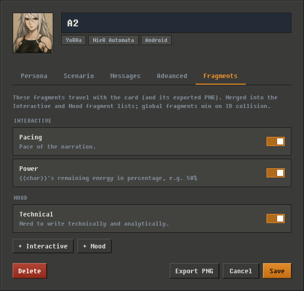

# Card-Embedded Fragments

You can bake **mood** and **interactive** fragments straight into a character card, so the character arrives with its own set of direction tools. Share the card with a friend, upload it to a hub, or re-import it later — the fragments travel inside the card file (and inside its exported PNG).

These are Orb's [Scene Direction](director.md) fragments: the moods and fill-in-the-blank fields the Director uses to steer a scene. Normally they live in *your* personal library and apply to every conversation. Card fragments let a character's **creator** pre-load fragments tuned for that one character — a curated direction preset that ships with the card.

## Why put fragments in a card?

Because it lets the creator decide how the Director should tell stories with that specific character. For example:

- A horror character ships a `dread` mood with atmospheric prompt text, plus a `sanity` progressive that creeps downward as the story unwinds.
- A courtly-drama character ships a `scandal` interactive that lists the active rumours, a `reputation` progressive, and a `court_gossip` feedback note.
- A quest-giver NPC ships a `quest_phase` field the Director updates as milestones pass.

## The one rule: your fragments always win

Every turn, just before the Director runs, Orb combines two sets of fragments:

- **Your global fragments** — the ones in your library (only the enabled ones).
- **The character's card fragments** — the ones baked into the card.

If a card fragment has the same **ID** as one of your global fragments, the card's version is thrown away and yours is kept. A card can *offer* a mood or interactive fragment, but it can never replace or override one you set up yourself.

This merge runs fresh on every turn. If you enable, disable, or add a global fragment mid-conversation, the next reply re-runs it. The card's own fragments never change (they're baked into the card), but which of them survive the merge depends on your current global setup.

## Authoring card fragments

Open a character's edit modal and switch to the **Fragments** tab.



This tab looks and works like the global fragment editor, but everything you do here changes **only this card's copy** — your global library is never touched. Add an interactive or mood fragment with the buttons at the bottom, click a fragment to edit it (delete it from its edit window), or flip its switch to enable/disable it. Nothing is written to the card until you save the character.

Card fragments follow the same validation rules as global ones: the ID must match `[a-z0-9][a-z0-9_-]{0,63}` (1–64 characters — lowercase letters, digits, `_`, and `-`), and labels and descriptions have length limits.

You **can't** give a card fragment the same ID as one of your current global fragments — the editor rejects it with an error. (Since your globals always win, such a fragment would never run anyway.)

## Where card fragments show up

While you're chatting with a character that has card fragments, they behave exactly like global fragments everywhere downstream:

- They become parameters on the Director's `direct_scene` tool, so the Director fills them the same way.
- The Writer sees the filled-in values in its Scene Direction block.
- The Editor and feedback step treat them identically too.

They also appear in the Mood and Interactive fragment lists in the chat sidepanel, grouped under a read-only **From character** heading below your own fragments. You can see them there but not edit, reorder, or toggle them — that's done in the character's Fragments tab. They are **not** copied into your global library, so they never show up for other characters.

## Sharing and importing

Card fragments are stored in the character card's V2 `extensions` data, under the key `orb.fragments`. When you export the card as a PNG, they travel inside the image. When someone imports that card, the fragments come with it and are ready the moment they start a conversation with the character — no setup needed.

And because your own global fragments always win on an ID clash (see [the one rule](#the-one-rule-your-fragments-always-win)), importing a stranger's card can never quietly replace a fragment you've configured.

## In a group chat

A [group](group-chats.md) has a cast rather than one character, so **every member's card contributes its fragments** to the scene, merged into a single set the same way one card's are. Your globals still win on an ID clash, and between two cards the first member in the roster keeps the ID. The sidepanel's **From character** list shows the whole cast's fragments together, and it re-reads them when you change the cast.

The fragments are scene-wide, not per-member: a mood a horror card ships steers whoever speaks next, not only that card's own turns.

## When card fragments don't run

Card fragments only run when a character that has them is in play — the active character of a conversation, or a member of a group's cast. So they don't run when:

- You're in document mode, or any mode with no assigned character.
- The card has no `extensions`, or nothing under `orb.fragments`.

Which **user persona** is active — pinned or global — makes no difference. A persona describes *you*, the user; card fragments always come from the character card in the conversation.

## Safety limits

Cards can come from anyone, so Orb treats a card's fragments as untrusted and checks every field before it reaches the Director. A malformed or malicious card simply loads fewer (or no) fragments — it never crashes Orb.

| Check | What happens |
|---|---|
| At most **50** mood and **50** interactive fragments per card | Anything beyond 50 of each type is ignored |
| Missing or invalid ID, or an empty label | That fragment is dropped |
| `enabled: false` | That fragment is skipped |
| Duplicate IDs within the same card | The first one wins; the rest are dropped |
| Unknown `field_type` | Falls back to `string` |
| Unknown `direction_note_timing` | Falls back to `post_turn` |

A valid `field_type` is one of `string`, `array`, `progressive`, `feedback`, or `direction_note`; a valid `direction_note_timing` is `pre_writer` or `post_turn`.

## Fragment format reference

If you hand-author a card's JSON (for example, in a card-creation tool), place fragments under `extensions.orb.fragments` inside the card's `data` object:

```json
{
  "spec": "chara_card_v2",
  "data": {
    "name": "My Character",
    "description": "...",
    "extensions": {
      "orb": {
        "fragments": {
          "mood": [
            {
              "id": "dread",
              "label": "Dread",
              "description": "Use when the atmosphere turns oppressive or frightening",
              "prompt_text": "Write with creeping dread. Let silences feel heavy. Every detail should feel ominous.",
              "negative_prompt": "Relax the tension. Return to a calm, matter-of-fact tone.",
              "enabled": true
            }
          ],
          "interactive": [
            {
              "id": "suspicion_target",
              "label": "Suspicion Target",
              "description": "Which character or faction the protagonist currently suspects. Pick the most narratively tense option.",
              "field_type": "string",
              "injection_label": "Suspicion",
              "required": false,
              "direction_note_timing": "post_turn",
              "enabled": true
            }
          ]
        }
      }
    }
  }
}
```

You can omit either list if you don't need it — a missing or empty `mood` or `interactive` key is fine. If both are missing (or `fragments` itself is missing), the card just loads normally with no fragments.

!!! tip "Ordering"
    You don't set a sort order for card fragments. Orb automatically places them **after** all your global fragments — in the order they appear in the card's list — both in the Director's `direct_scene` parameters and the Writer's Scene Direction block. Any `sort_order` you put in the JSON is ignored.
