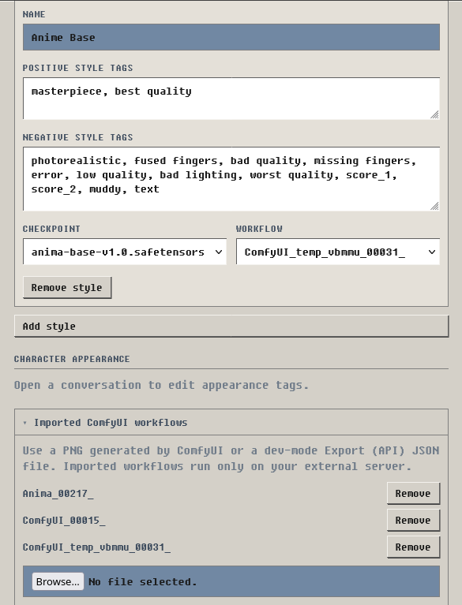

# Image Generation

Orb can generate an image of the current scene. You request each image on demand.

Orb uses a ComfyUI server to render the image. Orb does not install ComfyUI or
image models. For a quick, out-of-the-box setup, see [ComfyUI Setup](comfyui-setup.md).
For hardware requirements and advanced options, refer to the
[official ComfyUI documentation](https://docs.comfy.org/installation/system_requirements).

## Before you start

Make sure that you have these items:

- A working LLM endpoint in Orb
- A running ComfyUI server
- At least one checkpoint in ComfyUI
- Network access from Orb to the ComfyUI server

The LLM reads the conversation and writes the image prompt. ComfyUI uses this
prompt to make the image.

## Enable image generation

1. Open **Workflow**.
2. Select the **Secondary** tab.
3. Turn on **Image Generation**.

The **Image Generation** card shows the saved ComfyUI URL and the current
configuration status.

## Connect Orb to ComfyUI

First, this is what the UI look like (at least part of it):

Now, time to connect:

1. Start ComfyUI.
2. In Orb, Open **Workflow** and select the **Secondary** tab.
3. In the **Image Generation** card, select **Settings**.
4. Enter the ComfyUI URL.
5. Enter an API key if your server uses a Bearer token.
6. In each style that uses the Orb core workflow, select a checkpoint.
7. Select **Test connection**.
8. Make sure that the result is **Connected**.
9. Select **Save**.

Use `http://127.0.0.1:8188` when Orb and ComfyUI use the same computer and the
ComfyUI port is `8188`.

The **Orb core workflow** uses standard ComfyUI nodes. It makes a 1024 × 1024
image. Some models need a different workflow. For these models, import a
compatible ComfyUI workflow.

!!! note
    **Test connection** checks all styles in the form. Each style must use an available
    checkpoint and a valid workflow.

## Import a ComfyUI workflow

Use an imported workflow when the Orb core workflow is not compatible with your
model. The ComfyUI server must have all nodes and models that the workflow uses.

Orb accepts these files:

- An API-format JSON workflow
- A ComfyUI output PNG that contains workflow metadata

If you previously followed the tutorial in [ComfyUI Setup](comfyui-setup.md), import 
the .png file here.

A normal ComfyUI workflow JSON file is not an API-format file. In ComfyUI,
turn on the developer options. Then use **Save (API Format)** or **Export
(API)**. The exact label depends on your ComfyUI version. ComfyUI documents the
developer switch under [Comfy settings](https://docs.comfy.org/interface/settings/comfy).

To import the workflow, do these steps:

1. Open **Image Generation** settings.
2. Open **Imported ComfyUI workflows**.
3. Select the API-format JSON file or the ComfyUI PNG file.
4. Enter a name for the workflow.
5. Check the selected prompt, seed, image output, and model slots.
6. Select **Confirm slots and add workflow**.
7. In a style, select the imported workflow.
8. Select a checkpoint if Orb must replace the model in the workflow.
9. Select **Test connection**.
10. Select **Save**.

If a PNG does not contain workflow metadata, export an API-format JSON file
from ComfyUI instead.

## Make an image

1. Open **Workflow** and select the **Secondary** tab.
2. In the **Image Generation** card, select a style.
3. Find the assistant reply that you want to show as an image.
4. Select the image button. Its tooltip is **Visualize reply**.
5. Wait for Orb and ComfyUI to complete the image.

Orb shows the current phase. The phase can be prompt composition, queue wait,
or rendering. If another render is before your render, Orb shows the number of
renders in front of it.

Select the image button again to cancel an active render.

## Use image variants

The image has two action buttons:

| Action | Result |
|---|---|
| **Reroll** | Orb uses the stored prompt and settings. It uses a new seed. |
| **Regenerate** | Orb writes a new prompt. It uses the current style and character settings. |

Orb keeps each result as a variant. Use the left and right arrows to view the
variants. The counter shows the active variant.

Open **Render details** to see the style, seed, prompt, and negative prompt.
Select the style name in these details to edit that style.

Use the delete button in the image header to remove a variant or its variant
group. Read the confirmation message before you continue.

## Set the character appearance (Optional)

Allow user-defined appearance tags to always come with the character. Common use case 
is name of a non-OC character, some image models do better with canon character names.

1. Open a conversation with the character.
2. Open **Image Generation** settings.
3. Find **Character appearance**.
4. Enter comma-separated appearance tags in **Appearance tags**.
5. Enter unwanted character features in **Negative tags**.
6. Select **Save appearance**.

Use fixed and visible details. For example, specify hair, eyes, body shape, and
usual clothes. Do not add a character-count tag such as `1girl`. Orb gets the
character count from the scene.

Negative tags apply only to this character profile. Style and scene negative
tags are separate.

## Change a style

Orb ships **Realistic** and **Anime** styles out of the box. A style contains these items:

| Item | Function |
|---|---|
| **Name** | Sets the name in the style list. |
| **Positive style tags** | Appends visual properties to the image prompt. |
| **Negative style tags** | Appends properties that ComfyUI must avoid. |
| **Checkpoint** | Selects the model file on the ComfyUI server. |
| **Workflow** | Selects the ComfyUI workflow for this style. |

The **Realistic** and **Anime** rows are seeded with starting tags that you can
edit or clear like those of any other style. Empty tag fields add no style tags.

To add a style, do these steps:

1. Open **Image Generation** settings.
2. Select **Add style**.
3. Enter a name and the style tags.
4. Select a checkpoint and a workflow.
5. Select **Test connection**.
6. Select **Save**.

You must keep at least one style.

## Analyze a complex scene

Turn on **Analyze complex scenes** when a scene has multiple characters or
important positions. Orb first identifies the visible characters, clothes, and
positions. Orb then writes the image prompt.

This option makes one additional LLM call for each new image or regenerated
image. A reroll uses the stored prompt and does not make this additional call.

## Enable prompter thinking

Turn on **Enable prompter thinking** when the Agent model benefits from reasoning
before it analyzes the scene or writes the diffusion prompt. The setting applies
to both prompt calls: the optional complex-scene analysis and the always-on prompt
composition call.

The prompter always uses Orb's Agent model lane. In single-model mode this is the
same endpoint and model as the Writer. In dual-model mode it uses the configured
Director/Editor endpoint, model, system prompt, and reasoning-effort setting.

Changing thinking mode can reduce prompt-cache reuse on providers that keep
thinking and non-thinking requests in separate cache lanes. Keeping the setting
stable gives the two prompter calls the best chance to reuse one another. Matching
the Editor setting may also improve reuse when an Editor-side call ran recently,
but provider behavior and the prompter's separate tool schemas mean this is not
guaranteed.

## Solve common problems

| Problem | Action |
|---|---|
| The image button is not shown. | Turn on the workflow. Use an assistant reply without an image. Make sure that this tab has write control. |
| The status says **Choose a checkpoint**. | Open each style that uses the Orb core workflow. Select a checkpoint. |
| The connection test fails. | Make sure that ComfyUI is running. Check the URL, port, firewall, and API key. |
| Orb cannot find a checkpoint. | Add the checkpoint to ComfyUI. Restart or refresh ComfyUI. Test the connection again. |
| ComfyUI rejects the workflow. | Check that the server has all required nodes. Check the selected checkpoint and imported slots. |
| The render times out. | Check the ComfyUI queue. Increase **Render timeout**. The allowed range is 10 to 900 seconds. |
| ComfyUI completes without an image. | Select a valid image-output node in the imported workflow. |
| Orb cannot write an image prompt. | Check the Orb LLM endpoint. Use a model that can make tool calls. |
| An old image shows **Bytes evicted**. | Select **Rehydrate**. Orb uses the stored prompt, settings, and seed to make the image again. |

The ComfyUI queue can continue a submitted job after the browser disconnects.
If you cancel a render, check the ComfyUI queue before you start another render.
