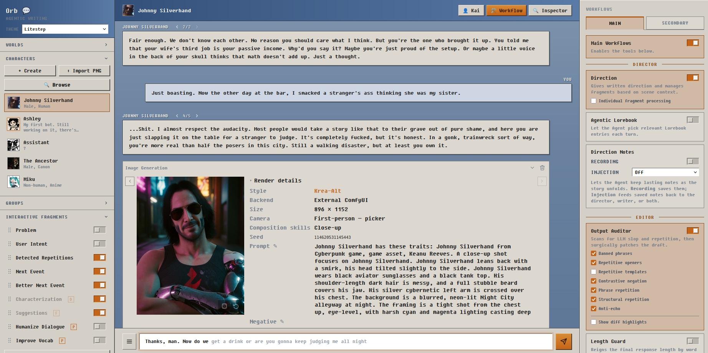
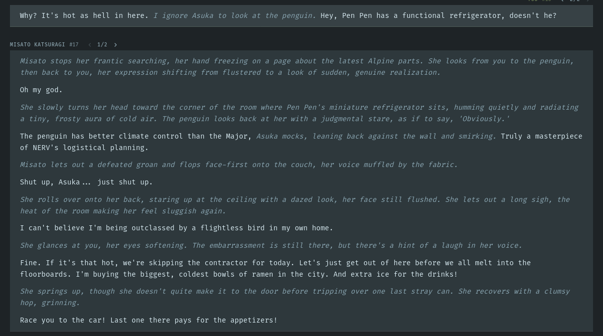
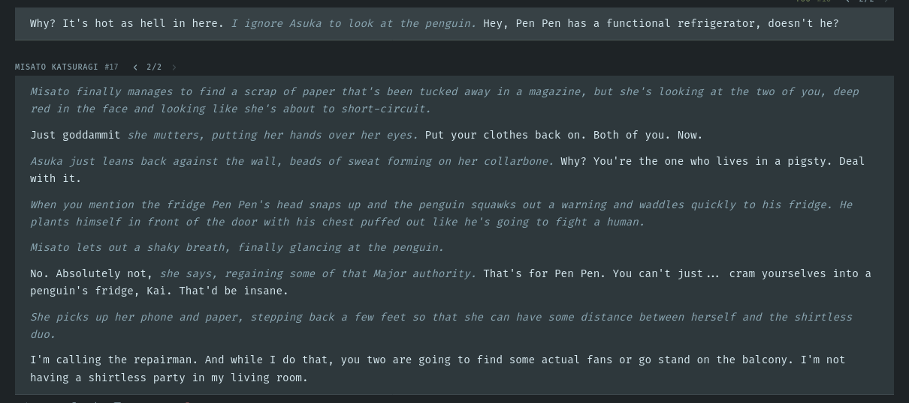

---
hide:
  - navigation
  - toc
---

# Orb

Orb is a roleplay and writing harness that connects your characters and conversations
to an LLM. It can also use optional local or cloud tools for scene direction,
editing, images, and speech.

## With and without Orb

Both replies were generated by Gemma 4 31B. Scenario: Broken AC unit during a hot 
summer, the user hints at cooling off in Pen Pen's fridge.

**Without Orb**, the reply misses the hint. It pads the prose with sloppy description: 
a "frosty aura", an expression "shifting from flustered to a look of sudden, genuine 
realization", eyes softening, "a hint of a laugh in her voice".

**With Orb's [core features](features/index.md)**, The Director spells out the hint.
The prose is cleaner and every line does something. All of Gemma 4's stock 
characteristics are nullified. There's also no repetition from previous messages.

## Start here

-   **[Getting Started](getting-started.md)**

    Install Orb, configure an LLM endpoint, and start a conversation.

-   **[Features](features/index.md)**

    Learn about direction, editing, writing tools, groups, and data management.

-   **[Multimedia](multimedia/index.md)**

    Set up image generation and text-to-speech.

-   **[Contributing](contributing.md)**

    Report a problem, suggest an improvement, or contribute code and docs.

